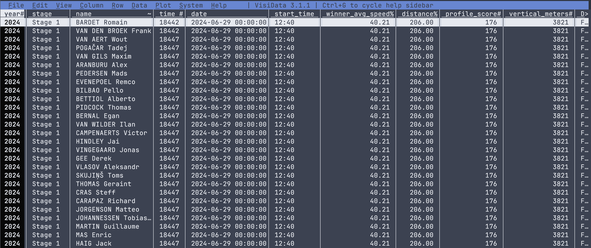
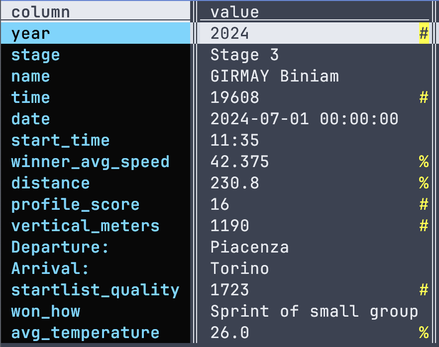
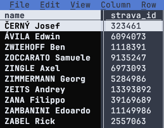
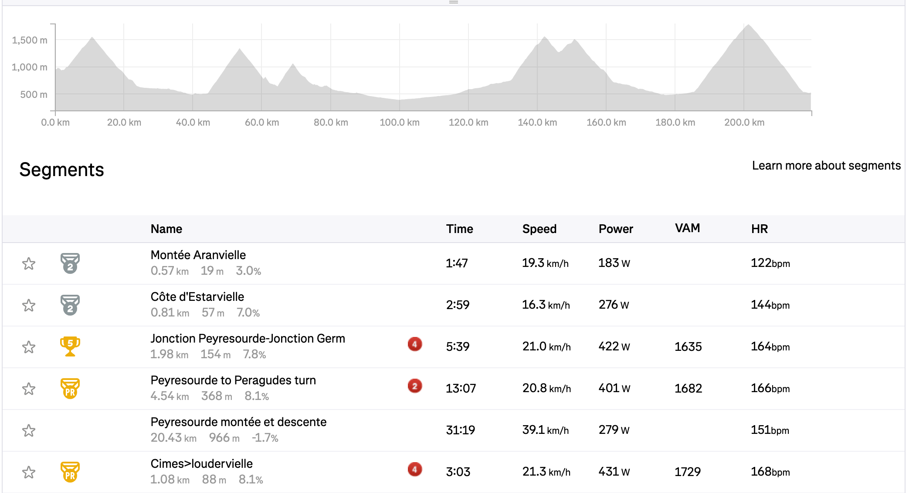
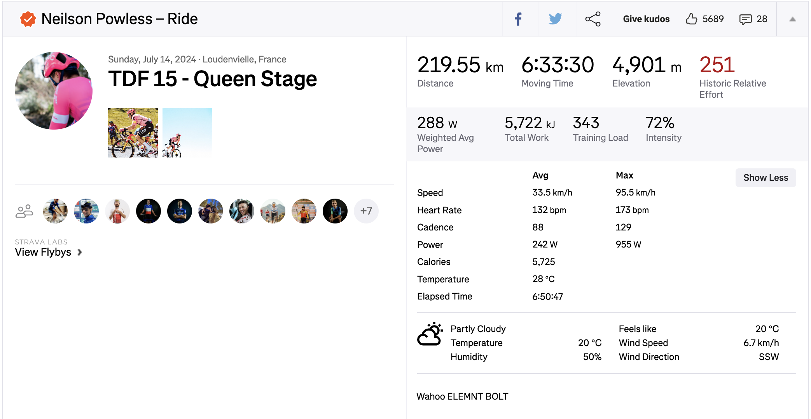
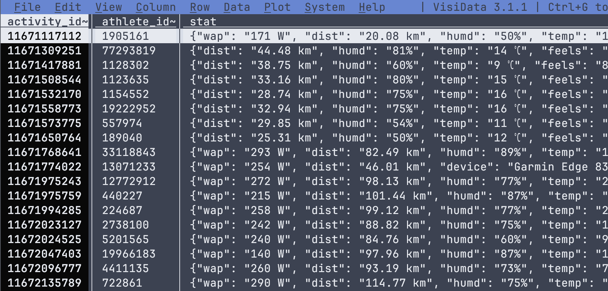
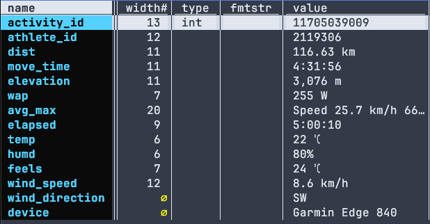

______________________________________________________________________

title: "Grand Tours Data Analysis-2 (The Database)"
date: 2024-12-27
permalink: /posts/2024/12/blog-post-2/
tags:

- tourde-france
- cycling
- data analysis

______________________________________________________________________

# The general structure

Initially, I thought a relational database might not be necessary for the
questions I wanted to address. However, I decided to create one anyway to
deepen my understanding of SQL and gain practical experience. Over time,
particularly with the data I scraped from Strava, the database proved to be quite
useful. Before diving into the details of the scraping process,
I'll first discuss the structure of the database, starting with the relational
table outlined below.

<pre class='mermaid'>
erDiagram
    tdf_results {str name FK
  int year
  int time}

    strava_names {int athlete_id PK
  str name}

    segments_data {int activity_id PK
  int athlete_id FK

  }
    stats_data {int activity_id PK
  int athlete_id FK

  }

  strava_table {int activity_id PK
  int athlete_id FK

  }
     strava_names||--|{  tdf_results: ""
     strava_names||--|{  segments_data: ""
     strava_names||--|{  stats_data: ""
     strava_table||--||  stats_data: ""
     strava_table||--||  segments_data: ""

  </pre>

The primary tables in our database are `tdf_results`, `giro_results` and
`vuelta_results`, which were scraped from
[ProCyclingStats](https://www.procyclingstats.com), as an
[example](https://www.procyclingstats.com/race/tour-de-france/2024/stage-20).
These tables do not have primary keys (i.e., unique values) because their
structure involves repeated entries for each rider across different stages and
years, as shown below:

  
Each row includes the rider's name, the time for a
    specific stage, and the stage properties, which repeat across different
    stages and years. On the left we have the summary of the columns. The
    columns in these tables are largely self-explanatory, with the possible
    exceptions of <code>profile_score</code> and <code>starlist_quality</code>.
    These terms have specific definitions, which can be found in the original
    source links. Unless Strava data is included, it is relatively
    straightforward to extract insights using SQL queries, provided the
    questions are well-defined. 
 

  
    
  
Working with Strava datasets requires a more intricate approach for both scraping and structuring. We start with the <code>strava_names</code> table, which contains riders' <code>names</code> and their unique <code>athlete_id</code>. While constructing this table, we assumed that the names in the <code>results</code> table are unique. This assumption is reasonable, as the dataset only includes results from 2010 onward, aligning with Strava's historical data coverage. 
  

The table `strava_names` is simply scraped by first taking the names of the riders from `results` table starting from 2010. Then each name is searched through Strava search athlete tab. Once we have the result we simply choose the `athlete_id` number with the pro tag on in (see the image below).

After we forming the `strava_names` table we are now in a position to extract the data from riders profile. For that we first
visit the riders main page which looks like the following.

This page lists their activities weekly, so by using the date information from `results` tables we can pinpoint each tour week and scrape the `activity_id`s through the event. Luckily each `activity_id` is unique like the `athlete_id`. There is one thing we need to be careful though, although we scraped the activities during the event by the nature of this scraping process we also extracted some extra activities. Because as you can imagine some riders upload all of their rides including a ride to start position or rides in their rest days and so on. Therefore we need a way to clean those activities, which we will discuss after explaining the `segments_data` and `stats-data` tables.

The more data-intensive Strava tables are `segments_data` and `stats_data`. As the name suggests, `segments_data` is scraped from the segment information of a Strava ride. This table can become quite extensive, depending on the number of segments. It includes details such as time, speed, VAM (Vertical Ascent in Meters), power, and heart rate—if the rider has chosen to upload these metrics.

In the `segments_data` table, we chose to keep the `activity_id`, `athlete_id`, `date`, and `distance` fields explicit while bundling the `segments` data into a JSON blob. Since the `activity_id` serves as the primary key, it can efficiently distinguish between rides. A snapshot of the table can be seen below.

The `stats_data` table contains general data scraped from Strava ride summaries. Since the type of data varies significantly between rides, it also makes sense to store this information as a JSON blob, similar to the `segments_data` table.

The following provides an example of the structure of the `stats_data` table, along with detailed column information for the `segments` and `stats` tables.

Segments columns | Stats columns
:-------------------------:|:-------------------------:
 | 

Finally the `strava_table` is basically merge of `segments_data` and `stats_data` tables containing only the race

The reason for the need of this table will be more apparent once we discuss how the strava data is scraped.

